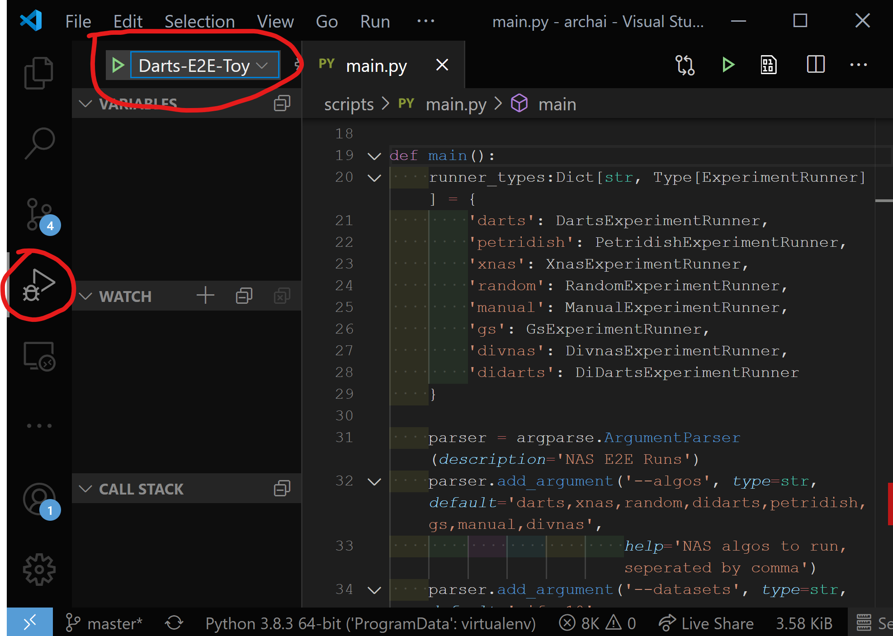

# Archai - A 30 Minute Tutorial

If you would like to follow through this tutorial, please make sure you have [installed](install.md) Archai.

## Network Architecture Search (NAS)

Network architecture search is the process of finding best performing neural network architectures for a given problem. Usually, we have a dataset such as [Imagenet](http://www.image-net.org/) and we want to figure out how to arrange operations as convolutions and pooling to create a neural network produce the best classification accuracy. Many practical situations also require that the architecture must fit into device memory or can use only certain number of flops. NAS shines in such problems because finding optimal architecture manually requires a lot of guess work and human effort.

So how do we automatically find the good neural architecture? There are a range of algorithms invented in the field of NAS research during past few years. In this tutorial we will learn how to use existing algorithms in Archai. We will also get the overview of how Archai works and finally we will implement a popular NAS algorithm called DARTS to show how you can implement your own algorithm. If you are not familiar with DARTS, we highly recommend [reading the paper](https://arxiv.org/abs/1806.09055) or [basic overview](https://towardsdatascience.com/intuitive-explanation-of-differentiable-architecture-search-darts-692bdadcc69c).

## Running Existing Algorithms

Running NAS algorithms built into Archai is easy. You can use either command line or Visual Studio Code. Using command line, run the main script specifying the `--algos` switch:

```bash
python scripts/main.py --algos darts
```

Notice that the run completes within minute or so. This is because we are using reduced dataset and epochs just to quickly see if everything is fine. We call this *toy mode*. Doing a full run can take couple of days on single V100 GPU. To do a full run, just add the `--full` switch:

```bash
python scripts/main.py --algos darts --full
```

You can also use other algorithms [available](algos.md) in Archai instead of DARTS. You can also run multiple algorithms by specifying them in comma separated list. There are plethora of other switches available which you can read more about in [config system](conf.md) later.

When you run these algorithms, Archai used cifar10 dataset as default. Later we will see how you can use other datasets. By default, Archai produced output in `~/logdir` directory.

We will use [Visual Studio Code](https://code.visualstudio.com/) in this tutorial however you can also use any other editor. Archai comes with preconfigured run configurations for VS Code. You can run DARTS in debug mode by opening the archai folder and then choosing the Run button (Ctrl+Shift+D):



## Config System


