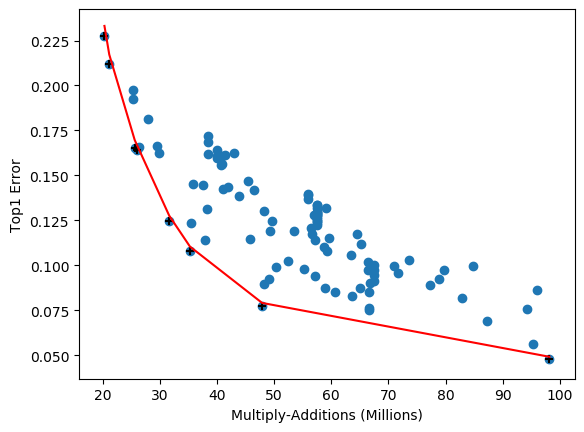
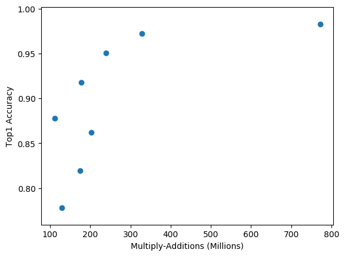

# Petridish - Code Walkthrough

## Background

Petridish is a NAS algorithm that grows networks starting from any network. Usually the starting network is very small and hand-specified although in practice any set of networks can be thrown in as seed networks. At each search iteration petridish evaluates a number of candidates and picks the most promising ones and adds them to the parent network. It then trains this modified network for a few more epochs before adding them back to the parent pool for further consideration for growth. Parents architectures are only selected for further growth if they lie close to the convex hull of the pareto-frontier (which serves as an upper bound of the error-vs-multiply-adds or error-vs-flops or error-vs-memory) curve. The intuition being only those models which are currently near the estimated pareto-frontier have realistic chance of lowering the curve by producing children models. Before we move ahead it will serve the reader well to familiarize themselves with the details via [paper at NeuRIPS 2019](https://www.microsoft.com/en-us/research/publication/efficient-forward-architecture-search/), [blog post](https://www.microsoft.com/en-us/research/blog/project-petridish-efficient-forward-neural-architecture-search/) or [online lecture](https://youtu.be/sZMZ6nJFaJY?t=2648). 

We will also assume that the reader has familiarized themselves with the core of Archai and followed through the [getting started tutorial](blitz.md) which will come in very handy!

## Search
All of Petridish functionality resides in the 
At the heart of Petridish is the [`SearcherPetridish`](https://github.com/microsoft/archai/blob/master/archai/algos/petridish/searcher_petridish.py) class which derives from the `SearchCombinations` class. Let's have a a look at the `search` function in that file. 

At first we are going to seed the search process with a number of models each of which differ in the number of cells (normal or reduction) and number of nodes within each cell.

```python
# seed the pool with many models of different
# macro parameters like number of cells, reductions etc if parent pool
# could not be restored and/or this is the first time this job has been run.
future_ids = [] if is_restored else  self._create_seed_jobs(conf_search,
                                                            model_desc_builder)
```

If you look inside the `self._create_seed_jobs` function you will find that it uses [`ray`]() to train all the seed models in parallel (one seed model per available GPU). Note that this is done asynchronously and the function does not block but just queues up the jobs and returns immediately. The actual training is handled by the `self._train_model_desc_dist` ray remote function call.  

```python
while not self._is_search_done():
    logger.info(f'Ray jobs running: {len(future_ids)}')

    if future_ids:
        # get first completed job
        job_id_done, future_ids = ray.wait(future_ids)

        hull_point = ray.get(job_id_done[0])

        logger.info(f'Hull point id {hull_point.id} with stage {hull_point.job_stage.name} completed')

        if hull_point.is_trained_stage():
            self._update_convex_hull(hull_point)

            # sample a point and search
            sampled_point = sample_from_hull(self._hull_points,
                self._convex_hull_eps)

            future_id = SearcherPetridish.search_model_desc_dist.remote(self,
                conf_search, sampled_point, model_desc_builder, trainer_class,
                finalizers, common.get_state())
            future_ids.append(future_id)
            logger.info(f'Added sampled point {sampled_point.id} for search')
        elif hull_point.job_stage==JobStage.SEARCH:
            # create the job to train the searched model
            future_id = SearcherPetridish.train_model_desc_dist.remote(self,
                conf_post_train, hull_point, common.get_state())
            future_ids.append(future_id)
            logger.info(f'Added sampled point {hull_point.id} for post-search training')
        else:
            raise RuntimeError(f'Job stage "{hull_point.job_stage}" is not expected in search loop')
``` 

In the above block of code we wait for any job in the queue to be completed in the `hull_point = ray.get(job_id_done[0])` line. Jobs returning from the pool can be either a trained seed or trained search model, or search model. By wrapping the job in a `ConvexHullPoint` class we can do bookkeeping on job stage and other meta-data.

If a seed model or a trained search model finishes, we add it to the convex hull (`self._update_convex_hull(hull_point))` and sample a new model from the current estimate of the convex hull and send it to a child ray process where search over promising candidate layers is carried out. This is encapsulated in the `SearcherPetridish.search_model_desc_dist` remote ray function. 

If a model in the search stage finishes it is sent to a ray child process (`self.train_model_desc_dist`) for further training where now the chosen candidate layer gets to affect the parent network's gradient flow.  

Now let's look at some key parameters in the configuration file [`petridish.yaml`](https://github.com/microsoft/archai/blob/master/confs/algos/petridish.yaml) which controls key aspects of the pareto-frontier search process.

```yaml
petridish:
    convex_hull_eps: 0.025 # tolerance
    max_madd: 200000000 # if any parent model reaches this many multiply-additions then the search is terminated or it reaches maximum number of parent pool size
    max_hull_points: 100 # if the pool of parent models reaches this size then search is terminated or if it reaches max multiply-adds
    checkpoints_foldername: '$expdir/petridish_search_checkpoints'
pareto:
    max_cells: 8
    max_reductions: 3
    max_nodes: 3
    enabled: True # if false then there will only be one seed model. if true a number of seed models with different number of cells, reductions and nodes will be used to initialize the search. this provides more coverage of the frontier.
model_desc:
    n_cells: 3
    n_reductions: 1
    num_edges_to_sample: 2 # number of edges each node will take inputs from
```

We have reproduced some key parts of the configuration file above. `petridish/convex_hull_eps` defines the tolerance value used to define a region around the lower convex hull of the 
error-flops or error-multiply-additions plot. From this region parent models are sampled to have a chance at producing children. `max_madd` currently set to 200M, means if any model is encountered which exceeds this threshold, the entire search process will be terminated. `max_hull_points` number of models are in the pool of parents then search is terminated as well. These parameters jointly control how long you want to continue search for and where you want to concentrate compute for search. 

The `pareto` section defines the maximum number of total cells, reduction cells and nodes to have in the skeleton of the architecture. Combined with the minimum values from the `model_desc` section, `self._create_seed_jobs` will enumerate these models.



Petridish will produce a gallery of models picked to be those models on the lower convex hull as seen above. 

## Evaluation
The gallery of models found by Petridish is then trained for longer (usually 600 or 1500 epochs and with/without other enhancements like [AutoAugment](https://arxiv.org/abs/1805.09501) preprocessing or [CutOut](https://arxiv.org/pdf/1708.04552.pdf) etc).

The code for model evaluation follows the usual pattern by overriding relevant parts of the `Evaluater` class and using `ray` for distributed parallel training of models on available gpus on the same machine.  



Above we see the Accuracy vs. multiply-additions gallery. For example the model at 328M multiply-additions achieves 97.23% top-1 accuracy on CIFAR10 with 3M parameters and using 600 epochs.


## Putting It All Together
Just as detailed in the [blitz](blitz.md) tutorial, we end up with our own `PetridishModelBuilder` and `EvaluaterPetridish` which we communicate to Archai via the `PetridishExperimentRunner` class and run the algorithm via `main.py`. 

Note that Petridish is not constrained to searching pareto-frontiers of error-vs-multiply-additions only. One can easily change the x-axis to other quantities like flops, memory, number of parameters, intensity etc. By changing the search termination criteria and the models used to seed the search process, one can control the part of the x-axis that one wants to focus compute on. 

We are looking forward to getting feedback, user stories and real-world scenarios that can be helped via Petridish.